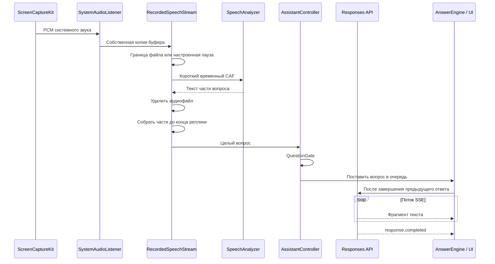
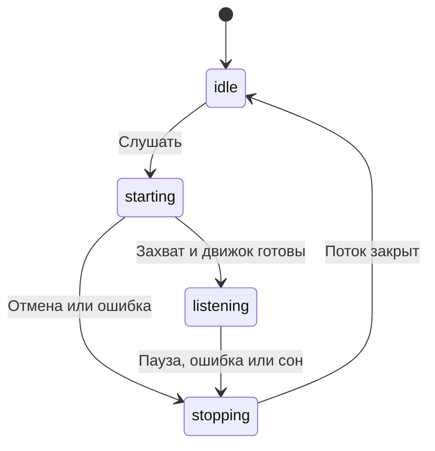

# Архитектура Dakt

Dakt — одно нативное приложение macOS. Собственного серверного компонента в репозитории нет: захват, подготовка звука, интерфейс и настройки работают на Mac; ответы приходят от настроенного API.

## Карта проекта

| Каталог | Ответственность | Основные компоненты |
| --- | --- | --- |
| [Sources/App](../Sources/App) | Запуск, меню у часов, окна и завершение | `AppDelegate`, `DaktRecorderApp` |
| [Sources/Audio](../Sources/Audio) | Захват системного PCM, уровень звука, границы фраз | `SystemAudioListener`, `AudioTurnGate` |
| [Sources/Transcription](../Sources/Transcription) | Распознавание, временные аудиофайлы и сборка реплики | `RecordedSpeechStream`, `AudioClipTranscriber`, `AppleSpeechStream`, `SpeechTurnBuffer` |
| [Sources/Assistant](../Sources/Assistant) | Состояние сессии, фильтр вопросов, ответы и шаблон встречи | `AssistantController`, `QuestionGate`, `AnswerEngine`, `LunaService`, `MeetingContextController` |
| [Sources/UI](../Sources/UI) | SwiftUI-представления и поведение нативных окон | `AssistantView`, `AssistantWindow`, `WindowInteractionLock` |
| [Sources/Support](../Sources/Support) | Настройки, секреты, импорт документов и восстановление после ошибок | `AssistantPreferences`, `Secrets`, `CorporateProxyProfile`, `ResumeImporter` |
| [Tests](../Tests) | Проверки границ модулей и регрессий | Буферы, потоки, отмена, контекст, окна |
| [Tools](../Tools) | Упаковка публичного дистрибутива | DMG, фон установщика, проверка содержимого |
| [.github/workflows](../.github/workflows) | Проверки и релизы | `ci.yml`, `release.yml` |

Имена `DaktRecorder` у бинарника и Swift-пакета и идентификатор `local.daktrecorder` сохранены для совместимости с существующими настройками и разрешениями. Название продукта — Dakt.

## Путь аудио и ответа

### Захват и границы фразы

`SystemAudioListener` использует ScreenCaptureKit для первого доступного дисплея и всего системного звука. Звук самого Dakt исключён. Микрофон не используется. Видео сконфигурировано только для работы системного потока: поступившие видеобуферы игнорируются.

Каждый аудиобуфер копируется, прежде чем передать его асинхронному потребителю: системный буфер может быть переиспользован после callback.

`SpeechTiming` задаёт начальную паузу **1,2 с** и диапазон **0,4–2,5 с**. Значение сохраняется в UserDefaults и применяется при запуске прослушивания.

`AudioTurnGate` различает техническую границу аудиофайла, примерно **12 с**, и настоящий конец реплики после настроенной тишины. Короткий одиночный щелчок короче **0,12 с** отбрасывается. Перед началом речи сохраняется примерно **0,25 с** звука.

`RecordedSpeechStream` обрабатывает файлы в порядке поступления, не заменяя ожидающий фрагмент новым. `SpeechTurnBuffer` соединяет результаты до финальной границы. Если речь оборвалась ровно на пределе файла, отдельный пустой маркер всё равно завершает реплику. Очередь ограничена восемью ожидающими частями: при перегрузке приложение сообщает об ошибке и останавливает захват, а не теряет части молча. Все изменения состояния записи выполняются на её последовательной очереди.

Граница проверяется при поступлении PCM и одноразовым таймером ближайшего окончания паузы или файла. При отсутствии открытого вопроса таймер не опрашивает часы. Если источник перестал присылать буферы тишины, таймер всё равно завершает реплику.

В старом движке `AppleSpeechStream` финальный результат системного запроса и его плановый перезапуск тоже сохраняют только часть текста. Вопрос публикуется после выбранной паузы, а не после каждого системного callback.

### Встроенные движки распознавания

| Движок | Требования | Где обрабатывается аудио |
| --- | --- | --- |
| `RecordedSpeechStream` + `AudioClipTranscriber` | macOS 26, установленная модель языка | На Mac: `SpeechAnalyzer` + `DictationTranscriber` |
| `AppleSpeechStream` | Разрешение на распознавание и работающая диктовка | На устройстве, когда доступно; иначе у Apple |

При чтении устаревших настроек неизвестный движок заменяется быстрыми аудиофрагментами на macOS 26 или системной диктовкой на прежних версиях macOS. Явный выбор поддерживаемого режима сохраняется.

### Фильтр и модель

`QuestionGate` локально определяет вопросы и просьбы объяснить что-либо, включая явную просьбу после длинного вступления без пунктуации. Это эвристика, поэтому есть ручная кнопка **Ответить сейчас**.

`LunaService` формирует запрос Responses API: `gpt-6-luna`, без инструментов, `reasoning.effort: "none"`, `stream: true`, `store: false`. Для одиночного вопроса инструкция просит два коротких предложения, до 45 слов. Для составной реплики модель получает указание ответить на каждый вопрос отдельным пунктом, до 120 слов суммарно. Обычный Responses endpoint ограничивает ответ 600 токенами; шлюз Codex не принимает этот параметр. Для шаблона встречи используются отдельные инструкции и тайм-ауты.

`LunaStreamDecoder` собирает SSE-фрагменты, обрабатывает ошибки и требует событие завершения. Обрыв соединения не считается успешным ответом.

`StreamingTextDelivery` хранит только последний ожидающий снимок текста и объединяет частые обновления перед `MainActor`. Первый фрагмент отправляется сразу; продолжение — с интервалом 50 мс. При сетевой паузе ожидающий текст доставляется таймером, при ошибке — перед показом ошибки. Завершение публикует полный ответ сразу, отмена отбрасывает ожидающие обновления. Тот же механизм используется при генерации шаблона встречи.

## Состояние и конкурентность

- Состояние интерфейса изменяется на `MainActor`.
- Захват и запись аудио используют отдельные последовательные очереди.
- Передача PCM между очередями идёт через `AudioRelay` с блокировкой.
- Поколения запросов в `AssistantController` и `AnswerEngine` отсекают опоздавшие callbacks.
- Автоматические вопросы обрабатываются `AnswerEngine` по очереди. Начатый ответ завершается и попадает в историю полностью.
- При ошибке модели очередь ждёт повтора. Повтор сохраняет ожидающие вопросы и обновляет конфигурацию подключения.
- «Ответить сейчас» явно отменяет текущий ответ и ожидающую очередь. Пауза также прекращает захват и очищает очередь.
- Завершённый ответ остаётся видимым, пока от следующего не пришёл первый текст.

## Окно и замок

Главное окно — прозрачный `NSPanel` со SwiftUI-содержимым. При блокировке оно фиксирует положение и размер и включает `ignoresMouseEvents`.

Поверх заблокированного окна находятся две маленькие дочерние `NSPanel`: для замка и для скрытия. Они принимают клики только в областях этих кнопок, не активируя основное окно. Их координаты пересчитываются по живым AppKit-представлениям, поэтому изменение размера не оставляет кнопки на старом месте.

`WindowHideButton` использует нативный `NSButton`, принимает первый клик в неактивном окне и всю область 28 × 28 pt. В заблокированном режиме та же кнопка размещена в дочерней панели. Скрытие убирает основное и дочерние окна, не затрагивая захват звука; возврат горячей клавишей восстанавливает обе кнопки.

Если точка привязки ещё недоступна, ввод не блокируется. **Показать Dakt** в меню у часов и повторное открытие приложения снимают замок. Скрытие по горячей клавише сохраняет текущий режим.

`ScreenPrivacy` применяет `sharingType = .none` и скрывает приложение из Dock в приватном режиме. Это не является гарантией исключения из современных способов захвата экрана.

`AudioActivity` обновляет индикатор только при заметном изменении уровня и видимом основном окне. Скрытие и перекрытие окна не останавливают захват или ответы. Нативные свойства окна переустанавливаются только при изменении закрепления, положения поверх окон или приватного режима.

## Контекст и хранение

| Данные | Место | Срок / назначение |
| --- | --- | --- |
| Ручные API-ключи и токен прокси | Keychain | До изменения пользователем |
| Настройки окна, резюме, шаблон встречи | UserDefaults | Между запусками |
| История собеседника | Память | Последние 80 реплик, до очистки или выхода |
| Предыдущие ответы | Память | До 20 ответов, до очистки или выхода |
| Контекст API-запроса | Настроенный API | До 8 последних реплик, вопрос, резюме и заметки |
| Короткие аудиофайлы | Временный каталог | Удаляются после обработки или штатной остановки |

`ResumeImporter` читает PDF через PDFKit, а TXT и Markdown — как текст. Ограничения: **10 МБ на файл**, **24 000 знаков**. OCR сканированных PDF не реализован.

`MeetingContextController` не перезаписывает заметки, отредактированные во время генерации: результат становится отдельным черновиком. Результат для заменённого резюме отбрасывается.

## Проверки

`swift test` проверяет владение аудиобуферами, секундные паузы, длинные вопросы через несколько файлов, очередь распознавания, завершение и повтор ответов, SSE, отмену, импорт резюме, сохранение ручных правок и геометрию замка. Тесты потока подают синтетические PCM-буферы с контролируемыми часами и распознавателем. Реальная сеть и захват не требуются.

Отладочный `--render-previews` рисует нативные экраны на фикстурах и проверяет события мыши, доступность отдельного окна замка и восстановление после повторного открытия. Снимки не содержат пользовательского резюме или реальных ключей.

`./Tools/performance-check.sh` измеряет синтетические нагрузки без сети и захвата. Методика и результаты — в [отчёте производительности](performance.md).
