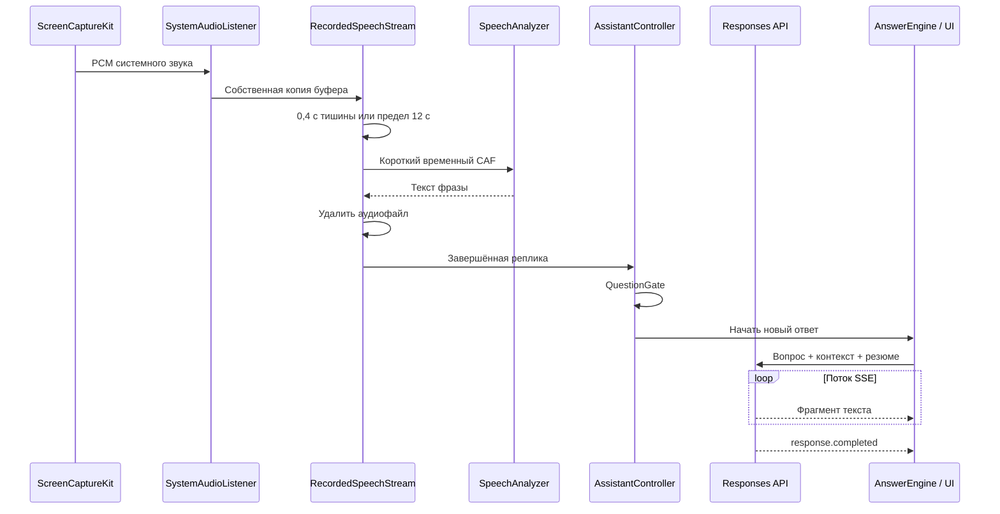
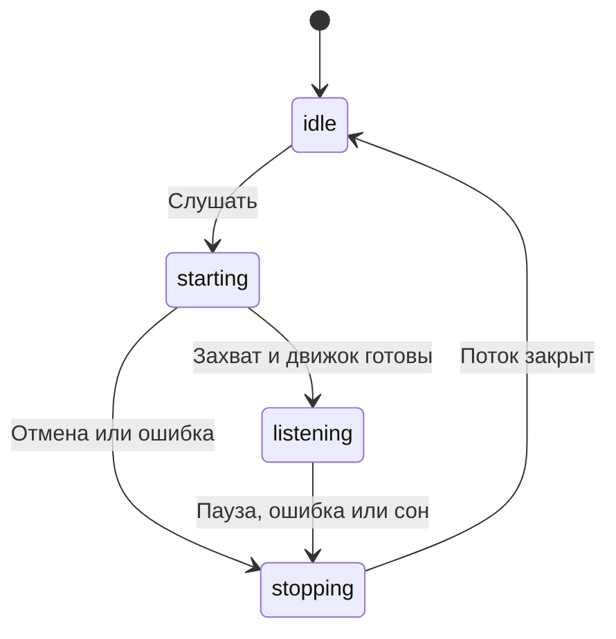

# Архитектура Dakt

Dakt — одно нативное приложение macOS. Собственного серверного компонента в репозитории нет: захват, подготовка звука, интерфейс и настройки работают на Mac; ответы приходят от настроенного API.

## Карта проекта

| Каталог | Ответственность | Основные компоненты |
| --- | --- | --- |
| [Sources/App](../Sources/App) | Запуск, меню у часов, окна и завершение | `AppDelegate`, `DaktRecorderApp` |
| [Sources/Audio](../Sources/Audio) | Захват системного PCM, уровень звука, границы фраз | `SystemAudioListener`, `AudioTurnGate` |
| [Sources/Transcription](../Sources/Transcription) | Распознавание и временные аудиофайлы | `RecordedSpeechStream`, `AudioClipTranscriber`, `AppleSpeechStream`, `WhisperSpeechStream` |
| [Sources/Assistant](../Sources/Assistant) | Состояние сессии, фильтр вопросов, ответы и шаблон встречи | `AssistantController`, `QuestionGate`, `AnswerEngine`, `LunaService`, `MeetingContextController` |
| [Sources/UI](../Sources/UI) | SwiftUI-представления и поведение нативных окон | `AssistantView`, `AssistantWindow`, `WindowInteractionLock` |
| [Sources/Support](../Sources/Support) | Настройки, секреты, импорт документов и восстановление после ошибок | `AssistantPreferences`, `Secrets`, `CorporateProxyProfile`, `ResumeImporter` |
| [Tests](../Tests) | Проверки границ модулей и регрессий | Буферы, потоки, отмена, контекст, окна |
| [Tools](../Tools) | Упаковка публичного дистрибутива | DMG, фон установщика, проверка содержимого |
| [.github/workflows](../.github/workflows) | Проверки и релизы | `ci.yml`, `release.yml` |

Имена `DaktRecorder` у бинарника и Swift-пакета и идентификатор `local.daktrecorder` сохранены для совместимости с существующими настройками и разрешениями. Название продукта — Dakt.

## Путь аудио и ответа

### Захват и границы фразы

`SystemAudioListener` использует ScreenCaptureKit для первого доступного дисплея и всего системного звука. Звук самого Dakt исключён. Микрофон не используется. Видео сконфигурировано только для работы системного потока: поступившие видеобуферы игнорируются.

Каждый аудиобуфер копируется, прежде чем передать его асинхронному потребителю: системный буфер может быть переиспользован после callback.

В быстром режиме `AudioTurnGate` закрывает фразу после **0,4 с тишины** либо после **12 с** непрерывного звука. Фрагменты короче **0,12 с** отбрасываются. До начала речи сохраняется примерно **0,25 с** предшествующего звука. Очередь ограничена текущим и последним ожидающим фрагментом.

### Три движка распознавания

| Движок | Требования | Где обрабатывается аудио |
| --- | --- | --- |
| `RecordedSpeechStream` + `AudioClipTranscriber` | macOS 26, установленная модель языка | На Mac: `SpeechAnalyzer` + `DictationTranscriber` |
| `AppleSpeechStream` | Разрешение на распознавание и работающая диктовка | На устройстве, когда доступно; иначе у Apple |
| `WhisperSpeechStream` | Совместимый сервер и его учётные данные | На настроенном сервере |

WhisperX — адаптер конкретного HTTP-протокола: `/login`, `/api/transcribe`, `/api/status/{id}`, `/api/download/{id}/json`. Это не произвольный OpenAI-совместимый speech endpoint. Адрес задаётся пользователем; TLS проверяет macOS.

### Фильтр и модель

`QuestionGate` локально определяет вопросы и просьбы объяснить что-либо, отбрасывает короткие подтверждения и повторы. Это эвристика, поэтому есть ручная кнопка **Ответить**.

`LunaService` формирует запрос Responses API: `gpt-6-luna`, без инструментов, `reasoning.effort: "none"`, `stream: true`, `store: false`. Цель обычного запроса — два коротких предложения, до 45 слов. Для генерации шаблона встречи используются отдельные инструкции и тайм-ауты.

`LunaStreamDecoder` собирает SSE-фрагменты, обрабатывает ошибки и требует событие завершения. Обрыв соединения не считается успешным ответом.

## Состояние и конкурентность

- Состояние интерфейса изменяется на `MainActor`.
- Захват и запись аудио используют отдельные последовательные очереди.
- Передача PCM между очередями идёт через `AudioRelay` с блокировкой.
- Поколения запросов в `AssistantController` и `AnswerEngine` отсекают опоздавшие callbacks.
- Новый вопрос отменяет предыдущий ответ. Пауза отключает захват и отменяет текущую генерацию.
- Сессия WhisperX переиспользует вход; отдельный actor управляет авторизацией.

## Окно и замок

Главное окно — прозрачный `NSPanel` со SwiftUI-содержимым. При блокировке оно фиксирует положение и размер и включает `ignoresMouseEvents`.

Для разблокировки поверх основного окна существует маленькая дочерняя `NSPanel`. Она принимает клик, не активируя основное окно. Её координаты пересчитываются по живому AppKit-представлению кнопки; сохранённые пиксельные координаты не используются. Это предотвращает потерю замка после изменения размера.

Если точка привязки ещё недоступна, ввод не блокируется. **Показать Dakt** в меню у часов и повторное открытие приложения снимают замок. Скрытие по горячей клавише сохраняет текущий режим.

`ScreenPrivacy` применяет `sharingType = .none` и скрывает приложение из Dock в приватном режиме. Это не является гарантией исключения из современных способов захвата экрана.

## Контекст и хранение

| Данные | Место | Срок / назначение |
| --- | --- | --- |
| Ручные API-ключи и пароль WhisperX | Keychain | До изменения пользователем |
| Настройки окна, резюме, шаблон встречи | UserDefaults | Между запусками |
| История собеседника | Память | Последние 80 реплик, до очистки или выхода |
| Предыдущие ответы | Память | До 20 ответов, до очистки или выхода |
| Контекст API-запроса | Настроенный API | До 8 последних реплик, вопрос, резюме и заметки |
| Короткие аудиофайлы | Временный каталог | Удаляются после обработки или штатной остановки |

`ResumeImporter` читает PDF через PDFKit, а TXT и Markdown — как текст. Ограничения: **10 МБ на файл**, **24 000 знаков**. OCR сканированных PDF не реализован.

`MeetingContextController` не перезаписывает заметки, отредактированные во время генерации: результат становится отдельным черновиком. Результат для заменённого резюме отбрасывается.

## Проверки

`swift test` проверяет владение аудиобуферами, границы фраз, запросы к API, SSE, отмену, импорт резюме, сохранение ручных правок и геометрию замка. Реальная сеть и захват не требуются.

Отладочный `--render-previews` рисует нативные экраны на фикстурах и проверяет события мыши, доступность отдельного окна замка и восстановление после повторного открытия. Снимки не содержат пользовательского резюме или реальных ключей.
