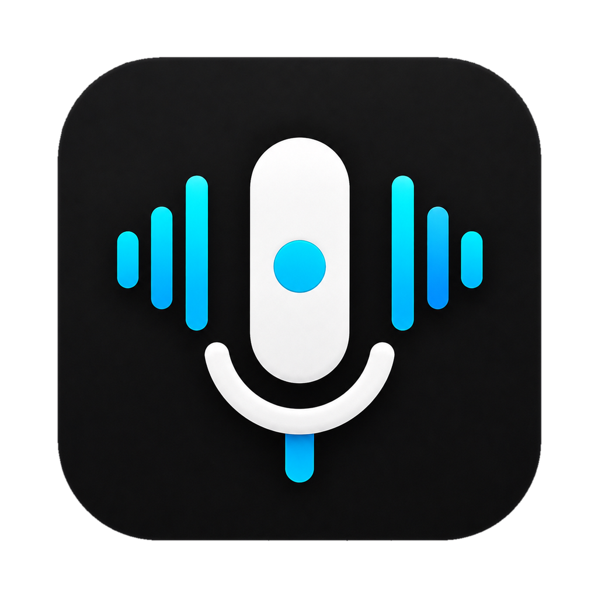
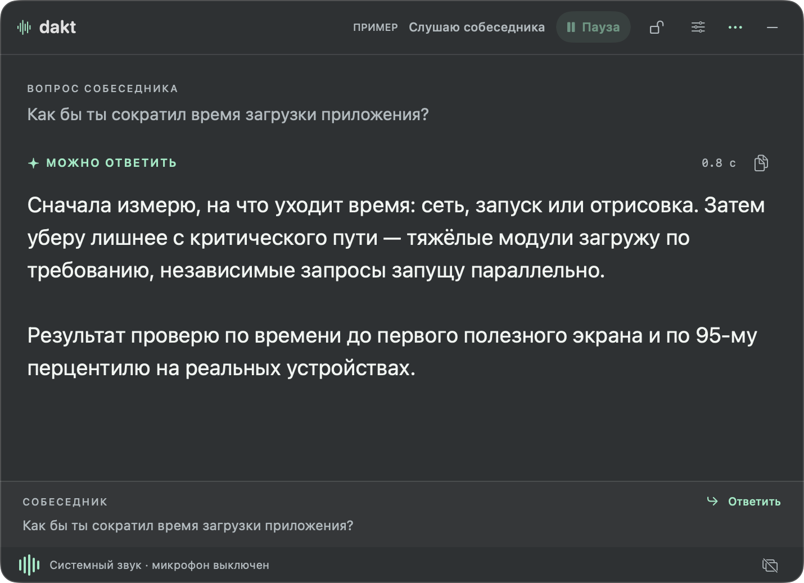
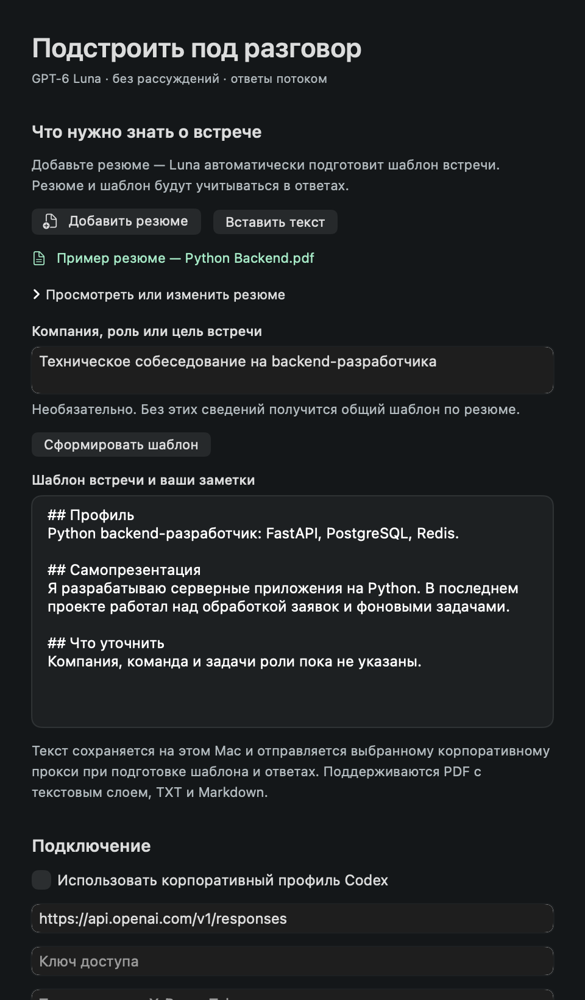
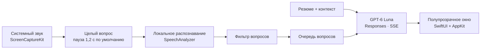

<p align="center">
  
</p>

<h1 align="center">Dakt</h1>

<p align="center"><strong>Подсказка в нужный момент.</strong><br />
Нативный помощник для разговоров на macOS: системный звук → вопрос → короткий ответ.</p>

<p align="center">
  <a href="https://github.com/meloch287/dakt/actions/workflows/ci.yml"></a>
  
  
  <a href="LICENSE"></a>
</p>

<p align="center">
  <a href="https://github.com/meloch287/dakt/releases/latest"><strong>Скачать DMG для Mac</strong></a>
  · <a href="Documentation/setup.md">Настроить</a>
  · <a href="Documentation/architecture.md">Архитектура</a>
  · <a href="CHANGELOG.md">Что нового</a>
</p>

<p align="center">
  
  <br /><sub>Настоящий интерфейс приложения. Содержимое и индикатор времени на скриншоте — демонстрационные данные.</sub>
</p>

Dakt слушает звук компьютера во время звонка в Zoom, VK Teams, браузере или другом приложении. Когда собеседник задаёт вопрос, в небольшом полупрозрачном окне появляется ответ GPT‑6 Luna. Текст поступает постепенно, поэтому его можно читать до завершения генерации.

Для ответов нужен собственный доступ к совместимому API или корпоративному прокси. Ключи и подписка в приложение не включены.

## Что умеет

| Возможность | Как это работает |
| --- | --- |
| **Системный звук** | Один источник для всех приложений. Микрофон не захватывается. |
| **Короткие ответы** | GPT‑6 Luna, потоковая выдача, режим рассуждений отключён. |
| **Целые вопросы** | Настраиваемая пауза, объединение длинных реплик и последовательные ответы без автоматического прерывания. |
| **Локальное распознавание** | На macOS 26 короткие аудиофрагменты обрабатываются SpeechAnalyzer. |
| **Контекст встречи** | Резюме в PDF, TXT или Markdown превращается в редактируемый шаблон встречи. |
| **Гибкое окно** | Размер, прозрачность, шрифт, положение поверх других окон и горячая клавиша. |
| **Замок** | Фиксирует окно и пропускает клики к приложениям под ним. Замок и кнопка скрытия «−» остаются доступными. |

## Установка

1. Скачайте **DMG** из [последнего релиза](https://github.com/meloch287/dakt/releases/latest). Один файл содержит сборки для Apple Silicon и Intel.
2. Откройте образ и перетащите **Dakt** в **Applications / Программы**.
3. Запустите Dakt. Релиз пока **не нотаризован Apple**: если macOS блокирует первый запуск, используйте **Системные настройки → Конфиденциальность и безопасность → Всё равно открыть**.
4. В настройках Dakt подключите API и нажмите **Проверить подключение**.
5. Нажмите **Слушать** и разрешите **запись экрана и системного звука**.

> Для быстрого локального распознавания нужны **macOS 26** и установленная модель выбранного языка. На macOS 13–15 доступен встроенный движок диктовки macOS. Особенности каждого режима — в [инструкции](Documentation/setup.md#распознавание).

## Подключение модели

Dakt отправляет запросы в **Responses API** с моделью `gpt-6-luna`, `reasoning.effort: "none"`, `stream: true` и `store: false`.

В настройках доступны два способа:

- **Корпоративный профиль Codex** — приложение читает выбранный поддерживаемый профиль и текущую авторизацию с этого Mac.
- **Ручное подключение** — HTTPS-адрес с окончанием `/responses`, ключ доступа и, при необходимости, токен прокси.

Нужен шлюз, поддерживающий эту модель и формат Responses. Совместимость с `/chat/completions` не предусмотрена. Введённые вручную секреты сохраняются в **Связке ключей macOS**.

[Подробнее о подключении и ошибках →](Documentation/setup.md#подключение)

## Подготовка к встрече

В настройках откройте **«Что нужно знать о встрече»**, добавьте резюме и укажите роль, компанию или цель разговора. Dakt сформирует шаблон: профиль, самопрезентация, опорные проекты, правила ответов и недостающие сведения.

Шаблон можно править и отменять последнее применение. Резюме и заметки сохраняются на Mac и передаются выбранному API при подготовке ответов. Исходный PDF как файл не загружается — используется извлечённый текст.

<details>
<summary>Посмотреть настройки контекста</summary>



Все данные на иллюстрации вымышлены.

</details>

## Управление

| Действие | Кнопка или сочетание |
| --- | --- |
| Слушать / пауза | **Слушать**, **⌘L** в активном окне |
| Скрыть / вернуть окно | **⌘⇧Space**, сочетание можно изменить |
| Скрыть мышью, в том числе при блокировке | **−** в правом верхнем углу |
| Пропускать клики сквозь окно | **Замок** рядом с кнопкой прослушивания |
| Вернуть управление при блокировке | Повторно нажать замок или **значок Dakt у часов → Показать Dakt** |
| Ответить на последнюю распознанную реплику вручную | **Ответить / Ответить сейчас** рядом с текстом собеседника; отменяет текущий ответ и очередь |
| Посмотреть предыдущие ответы | Меню **… → Предыдущие ответы** |

Скрытие окна продолжает прослушивание. Пауза останавливает захват и текущий ответ. Повторное открытие приложения из Finder или Dock также снимает блокировку.

## Длинные вопросы и паузы

В **Настройки → Распознавание собеседника → Пауза в конце вопроса** выберите ожидание от **0,4 до 2,5 секунды**. Начальное значение **1,2 секунды** сохраняет короткую остановку внутри вопроса. Для изменения настройки сначала поставьте прослушивание на паузу.

Техническая нарезка длинного аудио не запускает ответ на каждую часть: распознанный текст собирается до конца реплики. Если в ней несколько вопросов, модель получает их вместе и отвечает по пунктам.

Следующий автоматический вопрос встаёт в очередь. Текущий ответ дописывается и сохраняется в истории; пока у следующего ответа нет первых слов, завершённый текст остаётся на экране. При сетевой ошибке очередь ждёт **Повторить**. Для немедленного переключения на последнюю распознанную реплику есть **Ответить сейчас**.

## Данные и демонстрация экрана

- Постоянные записи встреч не создаются. Короткие временные фрагменты удаляются после обработки или штатной остановки.
- В быстром режиме аудио распознаётся локально. В API отправляются текст вопроса, последние реплики, резюме и контекст встречи.
- Старый движок диктовки может использовать серверы Apple, если для выбранного языка недоступна обработка на устройстве.
- Видео не анализируется и не сохраняется. В системном источнике слышны также уведомления, музыка и другие звуки компьютера.
- `store: false` задаёт поведение Responses API; правила хранения и журналирования самого прокси определяет его оператор.
- **Приватный режим не гарантирует невидимость при захвате всего экрана на новых macOS.** Для исключения подсказок демонстрируйте отдельное окно приложения и проверьте результат со стороны зрителя.

[Разрешения, хранение и восстановление работы →](Documentation/setup.md)

## Архитектура



Приложение написано на **SwiftUI и AppKit**, собирается через **Swift Package Manager** и не использует внешние пакетные зависимости во время работы. Распознавание, сетевые запросы и управление окном разделены по модулям.

[Устройство модулей, жизненный цикл и границы данных →](Documentation/architecture.md)

## Разработка

Нужны Xcode с **Swift 6.2+**, SDK macOS 26 и выбранный toolchain. SDK 26 нужен для сборки быстрого движка; целевая минимальная версия приложения — macOS 13.

```sh
git clone git@github.com:meloch287/dakt.git
cd dakt
swift test
./build.sh --out dist
open dist/Dakt.app
```

```sh
# Универсальная сборка Apple Silicon + Intel
./build.sh --universal --out dist

# DMG и SHA-256 из готового приложения
./Tools/package-dmg.sh dist/Dakt.app dist
```

DMG упаковывается отдельным инструментом разработки `dmgbuild`; в приложение Python не входит. [Сборка, подпись и релизы](Documentation/releasing.md) · [Как внести изменение](CONTRIBUTING.md).

## Лицензия

[MIT](LICENSE) · © 2026 [meloch287](https://github.com/meloch287).
